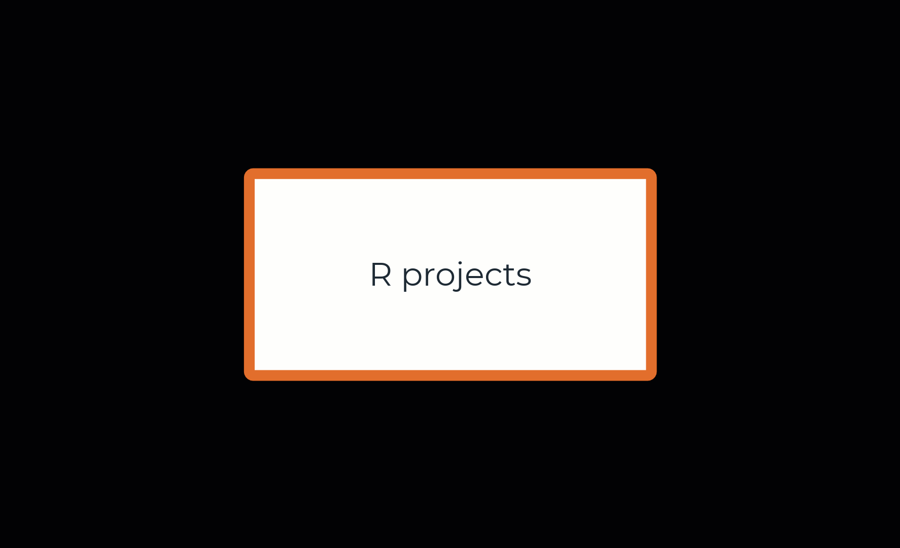
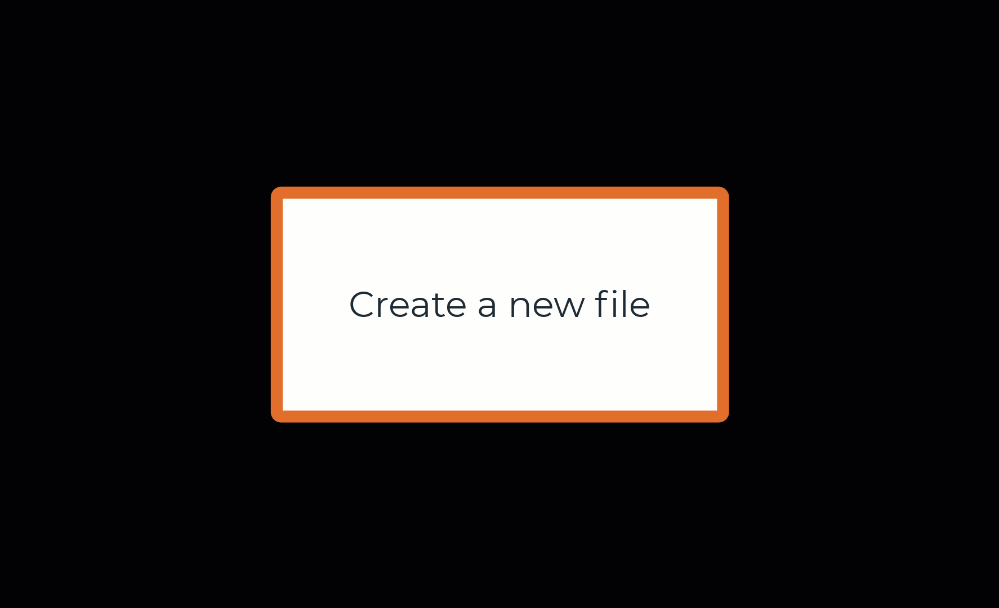
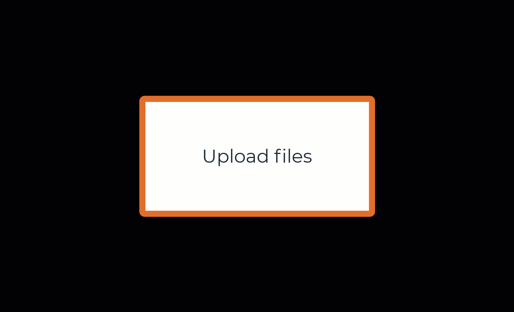
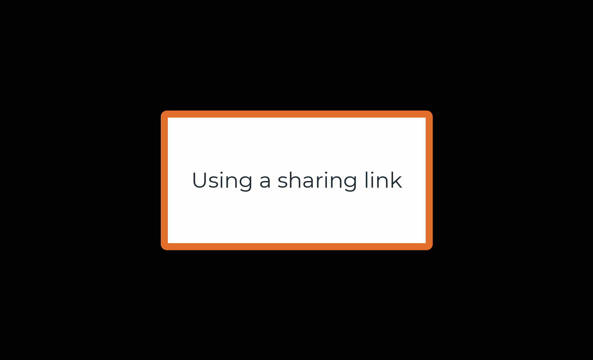
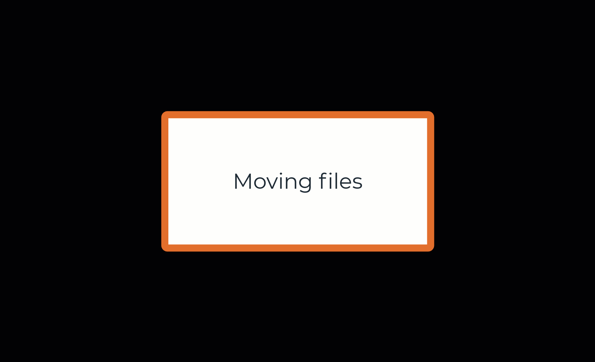
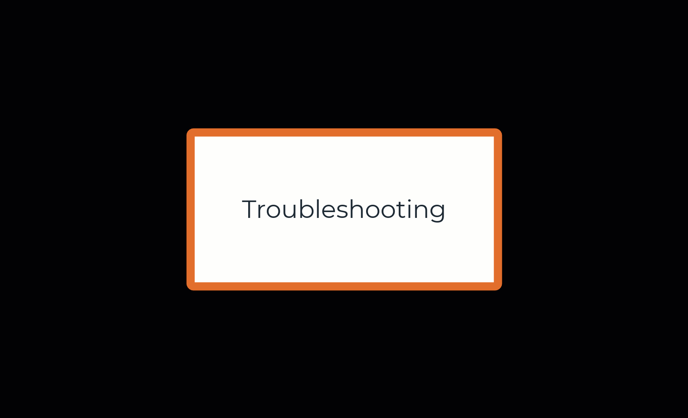

### Logging in

.left-column[
.midi[
1. Go to [jupyter.utoronto.ca](https://jupyter.utoronto.ca).
1. If you *are NOT logged in to your U of T account* in that browser, click 'Log in to Continue' and log in through the single sign on as usual.
1. If you *ARE logged in to your U of T account* in that browser, **select RStudio** before clicking 'Log in to start. This will open RStudio right away and you can skip the next step.
1. Click 'New' and select RStudio from the drop-down menu.
]
]

.right-column[

```{r, echo=FALSE, out.width="100%", fig.align="center"}
knitr::include_graphics("img/logingin.gif")
```

]

---
### Setting up your folders

.small[.footnote[Note: if you're using R projects (see next slide) a lot, I'd actually suggest naming assignment/activity folders as follows: **coursecode_assignment**, e.g. "STA303_a1". *Why?* Then when you look through recent project from the project menu, you don't want to have 3 different "Assignment1"s. Projects are automatically named after their folder.]]

.left-column[
- If you're using the JupyterHub for several courses, you'll want to come up with a sensible file and folder structure.
]

.right-column[

```{r, echo=FALSE, out.width="100%", fig.align="center"}

```

]

---
### R projects

.left-column[
- R projects can be a really helpful part of your workflow. 
- Learn more about them here in [*Chapter 8 of R for Data Science*](https://r4ds.had.co.nz/workflow-projects.html). 
- See the footnote on the previous slide for a consideration when naming your files. 
]

.right-column[

```{r, echo=FALSE, out.width="100%", fig.align="center"}

```

]

---
### Opening new files

.small[
.footnote[To open a new R script (.R) the keyboard shortcut is	Ctrl+Shift+N /	Cmd+Shift+N (except on Chrome/Windows) or 	Ctrl+Alt+Shift+N /	Cmd+Shift+Alt+N (Chrome only). [More shortcuts here](https://support.rstudio.com/hc/en-us/articles/200711853-Keyboard-Shortcuts).]]

.left-column[
- You can create a new R Notebook or other R Markdown files or an R script from the Files menu.
- RMarkdown is a great way to have your code, visualizations and commentary all in one place. Learn more in the [*Definitive Guide*](https://bookdown.org/yihui/rmarkdown/) and download the handy [**cheatsheet**](https://rstudio.com/resources/cheatsheets/)
]

.right-column[

```{r, echo=FALSE, out.width="100%", fig.align="center"}

```

]

---

```{r, echo=FALSE, out.width="90%", fig.align="center", fig.cap="Artwork by @allison_horst"}
knitr::include_graphics("img/rmarkdown_wizards.png")
```

---
### Uploading files from your local computer to JupyterHub

.left-column[
- Upload data and other required files in the **Files** pane.
- If you have multiple files, zip/compress them locally before uploading them. They will automatically be unzipped for you. You can't select multiple files in the uploader.
]

.right-column[

```{r, echo=FALSE, out.width="100%", fig.align="center"}

```

]

---
### Using a sharing link

.left-column[
- If you have been given a sharing link, an are logged in to your U of T account, clicking it should open RStudio for you.
  - [Here is an example](https://jupyter.utoronto.ca/hub/user-redirect/git-pull?repo=https%3A%2F%2Fgithub.com%2Felb0%2Fjupyterexample&urlpath=rstudio%2F&branch=main).
- You'll notice that the same files that were previously open will be opened again, not necessarily the file you want. 
- Navigate to 'Home' and you'll see the new folder there.
]

.right-column[

```{r, echo=FALSE, out.width="100%", fig.align="center"}

```

]

---
### Moving files

.left-column[
- You can move files and folders around to keep things organised.
- Click 'More' in the Files pane.
- Navigate to where you want to move the file and click 'Choose'.
]

.right-column[

```{r, echo=FALSE, out.width="100%", fig.align="center"}

```

]

---
#### A note on sharing links: getting back original files/updates from your instructor

If you want to get back original copies of any files, or your instructor updates the files for an assessment or activity, you can get/update these files by re-clicking the original provided sharing link. This will not overwrite your own work.

*If you've renamed your working folder or moved it into a subfolder*: Click the sharing link again. A new copy of the whole folder will appear in your Home folder. Move the files you want to the subfolder you are working in (see the previous slide). 

*If you haven't moved your working folder out of the Home folder nor renamed it*: Rename any files you have already worked on, for which you want to get the original. Click the sharing link again. Any new or missing files will now appear in your folder.
---
### Knitting Rmd files in RStudio

.left-column[
- When working with an R Markdown file (.Rmd) would will usually need to **Knit** to another format, such as PDF or HTML.
- Click the 'Knit' button, or if that isn't showing, there should be a down arrow next to 'Preview' that lets you choose the knitted file type.
]

.right-column[

```{r, echo=FALSE, out.width="100%", fig.align="center"}

```

]

---
### Exporting files from JupyterHub to your local computer

.left-column[
- Tick the files you wish to export (i.e. download to your personal machine).
- Go to the 'More' menu in the Files pane and select 'Export'.
- If you are exporting multiple files, they will export in a .zip file. I suggest giving it a meaningful name and then clicking 'Download'.
]

.right-column[

```{r, echo=FALSE, out.width="100%", fig.align="center"}
knitr::include_graphics("img/exporting.gif")
```

]

---
### Troubleshooting

.left-column[
.midi[
- Your session will time out after a period of inactivity. Refresh to reconnect.
- You can't have multiple RStudio windows open with the JupyterHub. You'll get a message that the old session has been disconnected when you open a new one.
- If you get out of RStudio you can get back in through the 'New' menu and then navigate using the Files pane or open a recent project.
]]

.right-column[

```{r, echo=FALSE, out.width="100%", fig.align="center"}

```

]

---
## A note about installing packages

There are several packages already installed for you on the JupyterHub.  E.g. you can run `library(tidyverse)` without installing tidyverse first.

If you have to install a package (i.e. use `install.packages("packagename")`) it will only remain installed for the duration of your session. That is, when you come back the next day, you will have to install it again. If you have experience with RStudio locally, this will be a bit different. If you get an error saying '`there is no package called`...' you probably need to re-add / un-comment the `install.packages()` part of your code.

---
class: center, middle

# Big thanks to the team working on this!

This is a proof of concept service, developed as a partnership between the Office of the CIO (Information Technology Services), the Faculty of Arts & Science’s new Computational and Data Science Education initiative, the 2i2c Consortium, and Microsoft Canada.